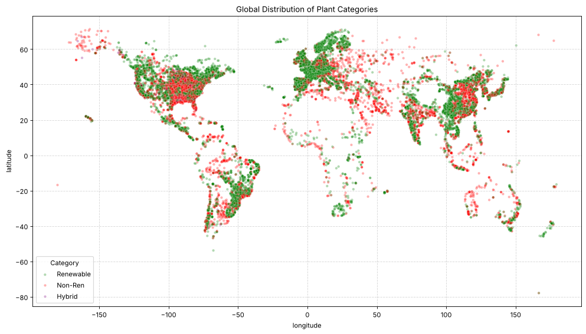
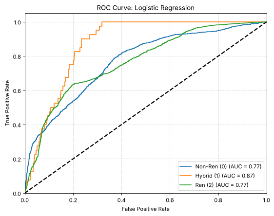

# 📊 Global Power Plant Classification & Analysis

Exploratory analysis and machine learning on the **Global Power Plant Database** (World Resources Institute): **28,664 power plants in 164 countries**.

The goal is to classify each plant as **renewable**, **non-renewable** or **hybrid** from its capacity, location and commissioning year, and to find natural groupings with unsupervised clustering.



## 🔍 What's Inside

**1. Data cleaning**
* Repaired corrupted latitude/longitude values with a precision fix.
* Created the target label from up to four fuel columns: non-renewable (9,413), renewable (19,003) and hybrid (248).
* Filled missing generation values with the dataset's estimates, and other numeric gaps with medians.

**2. Exploratory analysis**
* Showed that capacity is heavily right-skewed, then removed extreme outliers with a 3×IQR rule.
* Compared the energy mix of the top 10 producing countries with and without outliers.
* Mapped the global distribution of each plant category. Europe is the only continent where renewables outnumber non-renewables.

**3. Unsupervised learning**
* Ran **K-Means** on location and log-capacity (k = 4, chosen with the elbow method).
* Compared the clusters against the manual labels. One cluster is 80.9% renewable.

**4. Supervised learning**
* Split the data 60/20/20 into train, validation and test sets.
* Tuned **Logistic Regression**, **KNN** (k = 1–20) and **Decision Trees** (depth 1–15) on the validation set.

## 📈 Results (test set, 5,733 plants)

| Model | Accuracy | F1 Non-Renewable | F1 Renewable | ROC AUC (Non-Ren / Ren) |
| :--- | :---: | :---: | :---: | :---: |
| Logistic Regression | 0.73 | 0.41 | 0.83 | 0.77 / 0.77 |
| **KNN (k = 7)** | **0.85** | **0.77** | **0.89** | **0.90 / 0.90** |
| Decision Tree (depth = 11) | 0.84 | 0.75 | 0.88 | 0.86 / 0.87 |



**Limitation:** the hybrid class is under 1% of the data (248 plants). All three models struggle to detect it, which the precision-recall curves in the notebook make visible. Class re-weighting or oversampling would be the next step.

## 🛠️ Tech Stack
Python · Pandas · NumPy · Scikit-learn · Matplotlib · Seaborn

## 🚀 Run It
This project uses [`uv`](https://github.com/astral-sh/uv) for dependency management.

```bash
git clone https://github.com/FurkanSanlav/power-plant-analysis.git
cd power-plant-analysis
uv sync
```

Then open `analysis.ipynb` in VS Code or Jupyter and select the project's `.venv` as the kernel.

The dataset (`global_power_plant_database.csv`) is included in the repository.

## 📄 License
Released under the [MIT License](LICENSE).
